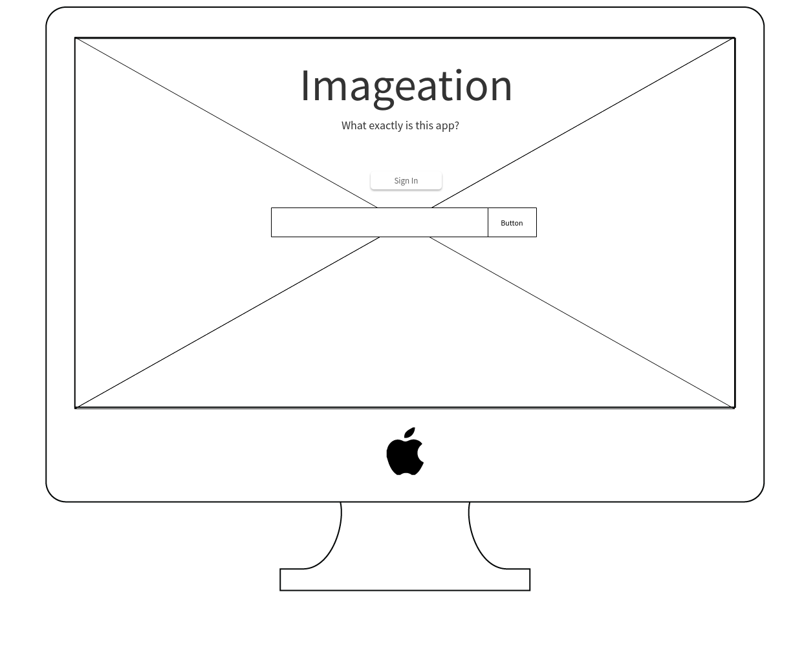
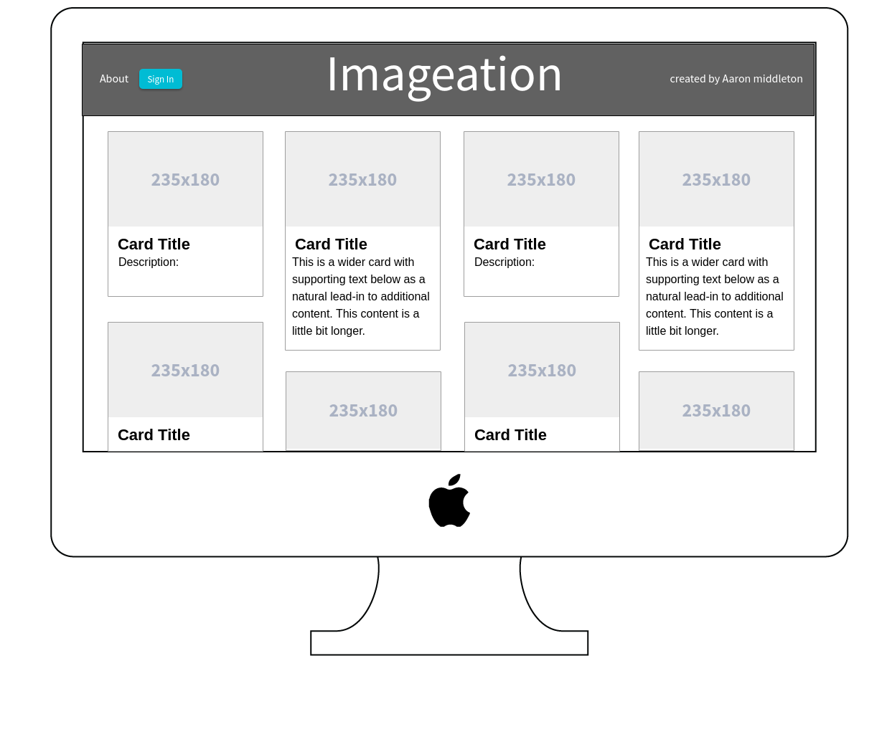

# Project2-Imageation

An application folks can utilize to use images as sources of inspiration. 

## Development

What was my [original inspiration and ideas](https://trello.com/b/bLHtwlxQ/imagination) .

Please check out the site at [IMAGEATION](https://imageation.herokuapp.com) to check out the site. 

### Wireframes

### Getting Started

Just type into the search bar a theme, place or media genre you think may help... 
more to come...

### Built With
  [behance api](https://www.behance.net/dev) . 
  [heroku](https://www.heroku.com/home) .
  [mongodb](https://www.mongodb.com) . 
  [mongoose.js](http://mongoosejs.com/index.html) . 
  [express.js](https://expressjs.com) . 
  [node.js](https://nodejs.org/en/) . 
  [javascript](https://developer.mozilla.org/en-US/docs/Web/JavaScript) . 
  [bootstrap](http://getbootstrap.comc) . 
  [pug](https://pugjs.org/api/getting-started.html) . 
  [css](https://developer.mozilla.org/en-US/docs/Web/CSS) .  
  [html](https://developer.mozilla.org/en-US/docs/Web/HTML)
### Additional APIs to come:
  [gettyimages](http://developers.gettyimages.com/en/) . 
  [imgur](https://api.imgur.com) 

# END
